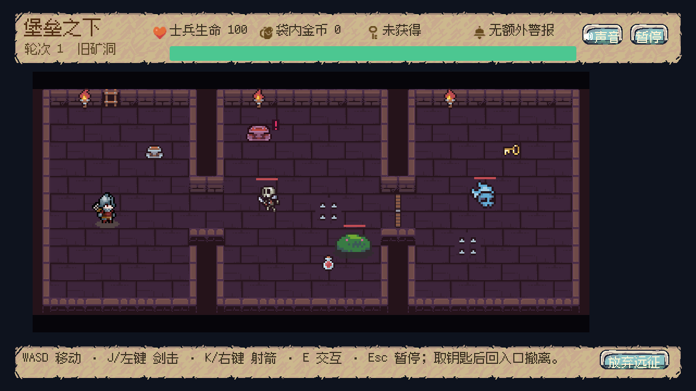
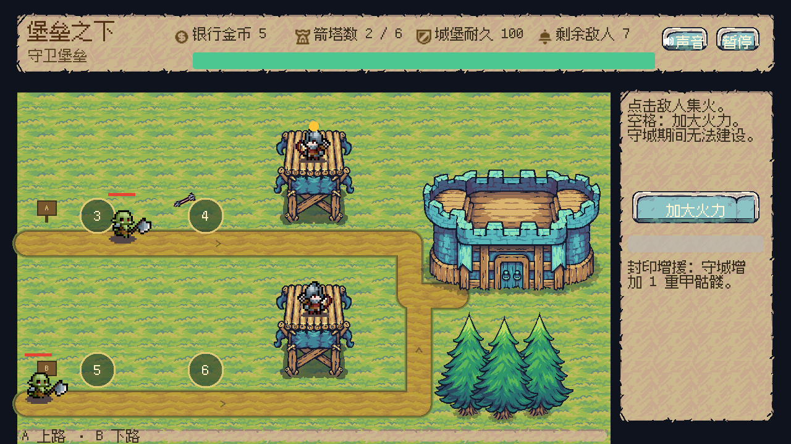

# Fortress Below

**A personal 2D dungeon exploration and tower defense demo built with Godot.**

[Chinese project overview](README.zh.md) | [Download the Windows demo](https://github.com/strawberry232/fortress-below/releases/latest)

The download is the previously validated v1.8 Windows build. The repository contains the current development source, which includes later changes. The existing demo was not rebuilt from this source snapshot. See [build provenance](docs/release/build-provenance.md).

## Demo screenshots

These are existing validation screenshots of the stable demo visuals.





Explore a dungeon, bring back gold, build or upgrade defenses, and defend a fortress along two fixed attack routes. The campaign has three consecutive rounds and preserves successful construction between rounds.

## Development and attribution

This project was developed with Codex AI assistance and Godot MCP tools. The creator directed gameplay design, requirements, asset selection, playtest feedback, and iteration acceptance. AI assisted with implementation, debugging, and refactoring.

Characters, interface elements, effects, and audio include third-party free assets. See [asset sources](docs/assets-and-attribution.md) for the distinctions and redistribution constraints.

## Source snapshot

This repository snapshot includes gameplay code, scenes, data, tests, localization, and licensed development dependencies. Raw game artwork, fonts, audio, and compiled export templates are excluded. **The snapshot requires those assets before the complete game and asset-dependent tests can run.**

Use Godot 4.7.2 with GL Compatibility. Restore the local assets listed in `docs/asset-files.csv`, open `project.godot`, and run the main scene. The Windows playable demo is distributed separately through GitHub Releases.

## Controls

| Action | Input |
| --- | --- |
| Move | WASD |
| Sword attack | J / left mouse button |
| Bow attack | K / right mouse button |
| Interact | E |
| Pause | Esc |
| Defense firepower skill | Space / skill button |

## Validation and packaging

The complete local v1.8 project recorded 323 passing unit tests and a three-round automated regression. Its Windows ZIP was reduced from 43.7 MiB to 13.1 MiB. These are historical full-project results; this asset-free snapshot has not been tested as a complete runnable game.

Development dependencies retain their own licenses. No blanket license is assigned to the creator's code or to third-party assets in this snapshot.

## Project layout

- `game/scripts/`: gameplay, combat, dungeon, defense, and UI logic.
- `game/scenes/`: main scene and scene resources.
- `game/data/`: enemy animations, dungeon layouts, and balance configuration.
- `test/`: unit tests and regression scripts.
- `docs/localization/`: runtime Chinese text.
- `tools/`: asset optimization, custom engine build, and release packaging tools.
- `addons/`: separately licensed Godot MCP Native and GUT dependencies.

After restoring the required assets, set `GODOT_EXE` to your Godot executable and run the unit suite in PowerShell:

```powershell
& $env:GODOT_EXE --headless --path . -s addons/gut/gut_cmdln.gd -gdir=res://test/unit/ -ginclude_subdirs -gexit
```

Custom optimized exports additionally require a compiled matching engine template; binaries are not committed here. The historical process is documented in [optimization notes](docs/v18-optimization.md).

When exporting, pass `-GodotPath` to `tools/export_release.ps1` or set `GODOT_EXE` to override the original local engine location.
